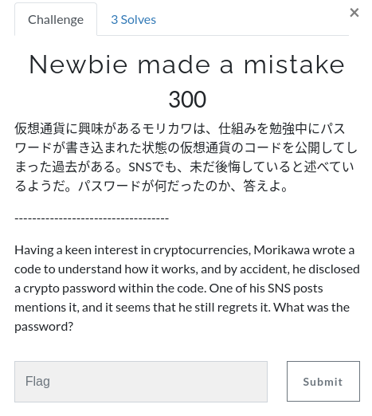
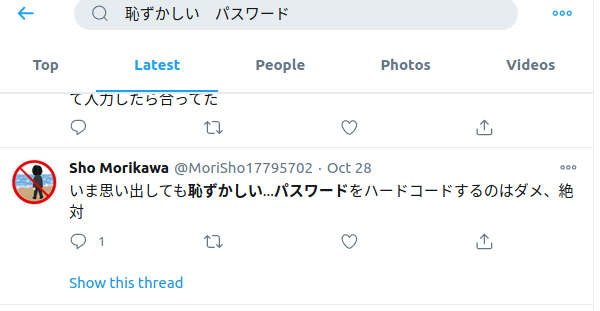
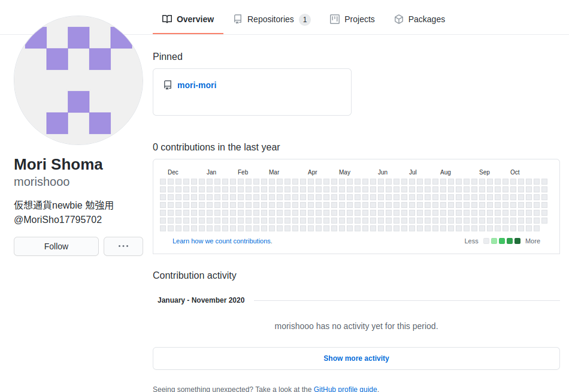
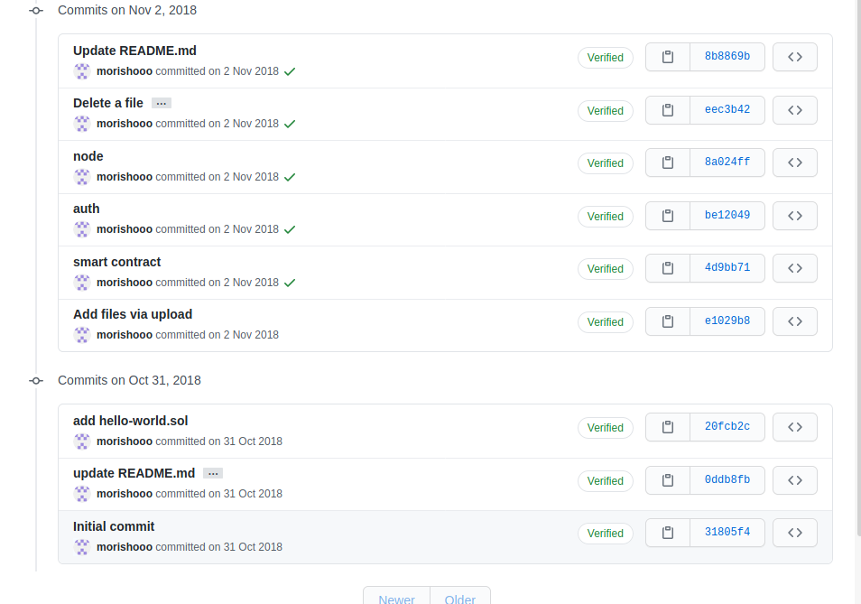

# 問題

# 解き方

Twitterでこのような検索をすると、下記のようなツイートを見つけた。

コードと公開というキーワードからgithubに公開したのだろうと推測。

TwitterIDで使われている「MoriSho」をgithubに検索すると。

bioの@MoriSho17795702という文字とTwitterIDが同じアカウントを見つけた。

これは、同一人物であることが分かる。

一つだけ公開レポジトリがあり、ここに問題のコードがあると推測。

コミットログを見ると「Delete a file」というコミットメッセージを見つけた。

何かを削除した痕跡と推測。

このコミットから、Javaのコードが復元できる。

どうやら、これがやらかしてしまったコードらしい。

loadCredentialsという関数に着目し

この関数のドキュメントを検索すると引数1つ目がパスワードなる。

https://docs.web3j.io/transactions/credentials/#use-walletutils-functionality

# trustno1$$letmein

